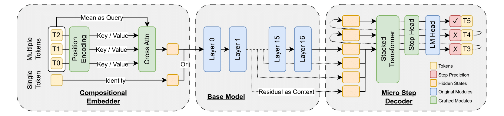
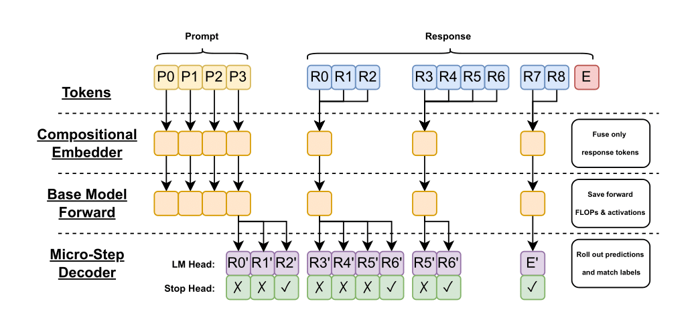
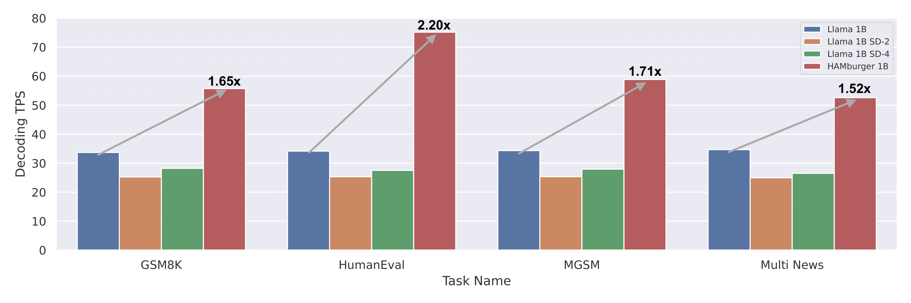
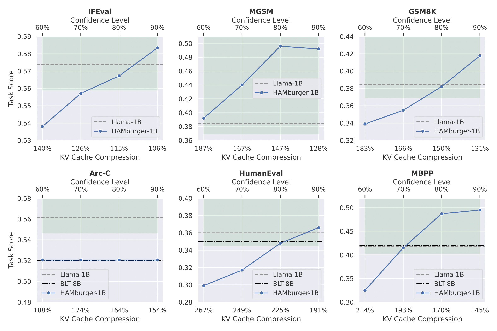
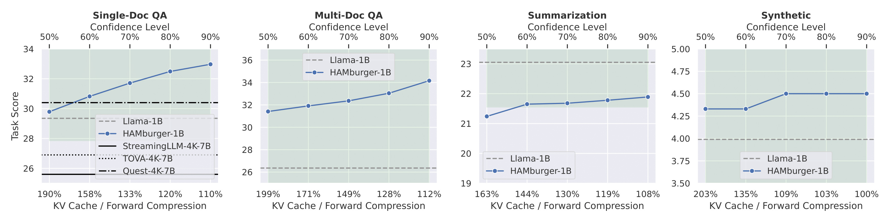

# HAMburger: Accelerating LLM Inference via Token Smashing

## Introduction
HAMburger is a hierachically auto-regressive model that can output multiple tokens per forward. Our approach reduces the growth of KV cache _computation_ from linear to sub-linear w.r.t. the generation length and achieves a TPS speedup proportionally. On both standard tasks and long-context tasks, HAMburger achieves up to 2x TPS boost and 2x KV cache computation (and storage) while maintaining or even surpassing the base model. 

(HAMburger-1B on the left and Llama-3.2-1B-Instruct on the right)


## Architecture
HAMburger stacks a standard LLM (e.g., Llama-3.2-1B-Instruct) with a relative-position-aware compositional embedder before it that smashes multiple tokens into one from the last step, and a micro-step decoder after it that outputs tokens with constant FLOPs. 



## Environment Setup
Use conda as below:
```bash
conda create -yn hamburger python=3.10.15
conda activate hamburger
pip3 install -r requirements.txt
```

## Training
HAMburger is instruction-finetuned with publicly available datasets and we provide both the training code and our trained checkpoints for full reproduction. 

Here's the overall training flow:


### Data Preparation
We prepared scripts for processing the data automatically and you can easily extend that by adding new datasets:
```bash
bash data_scripts/process.sh
```

### Start Training
We trained our 1B model with 8xH100s. To reproduce our results, we suggest running: 
```bash
python3 -m hamburger.train
```

## Inference
We implement HAMburger on both GPT-Fast and HuggingFace for a balance of simplicity and performance. 



### Generation Demo
To run streaming demo, simply do the following and choose the option based on guidance:
```bash
python generate.py
```

To run GPT-Fast version, please read guidance [here](./hamburger_gpt_fast/README.md). 

### Evaluate Results
Standard tasks:

Long Bench: 

All evaluation-related files are stored in `./eval`. To run LongBench, simply run:
```bash
cd ./eval/long_bench
bash eval_long_bench.sh
python summarize_results.py # this is optional
```

To run standard tasks, we rely on `lm_eval` and `evalplus`:

1. First, we need to apply some patches to `lm_eval` by copying (overwritting) `./eval/standard/lm_eval_patch/*` to your conda `lm_eval/tasks`.  
2. Can can setup a server that has common API:
```bash
bash ./eval/launch_server.sh hf # for baseline
bash ./eval/launch_server.sh hamburger 0.8 # for hamburger
```
3. Run any commands found in `./eval/standard/client.sh` for each individual task. 

## FAQ

1. **How is HAMburger different from other multi-token LLMs such as Byte Latent Transformer, MegaByte, and BlockTransformer?**

- HAMburger outputs at the granularity of tokens instead of bytes, making it more efficient at inference than methods that are based of bytes. 
- HAMburger can dynamically decide how many tokens to generate at each macro-step instead of fixing a patch size, which can fully utilize the model's knowledge to maximally take advantage of a KV cache's capacity. 
- HAMburger is standalone and does not require serving a separate model for segmentation during inference. 
- HAMburger is the only instruct fine-tuned model, well evaluated on downstream chat tasks and ready to be used by many applications. 

2. **How do we compare HAMburger to speculative decoding?**

    HAMburger can be regarded as a special case of self-speculative decoding with several favorable features:
- All drafted tokens from the micro-step decoder will be accepted from the last macro-step, and would stop generation otherwise. 
- A single forward (and hence a single KV cache) is required for _verification_ regardless of the number of tokens produced from last step. 
- No alignment of the draft model is needed as the training itself has implicitly performed the process like MTP. This also greatly simplifies the serving complexity. 
- A tunable paramter called confidence-level is introduced to help trade-off quality and speedup. 
- Finally, we want to emphasize that HAMburger is extremely batch-friendly due to highly parallelizable drafted modules, which makes it suitable for high-throughput applications where speculative decoding can become less effective. 